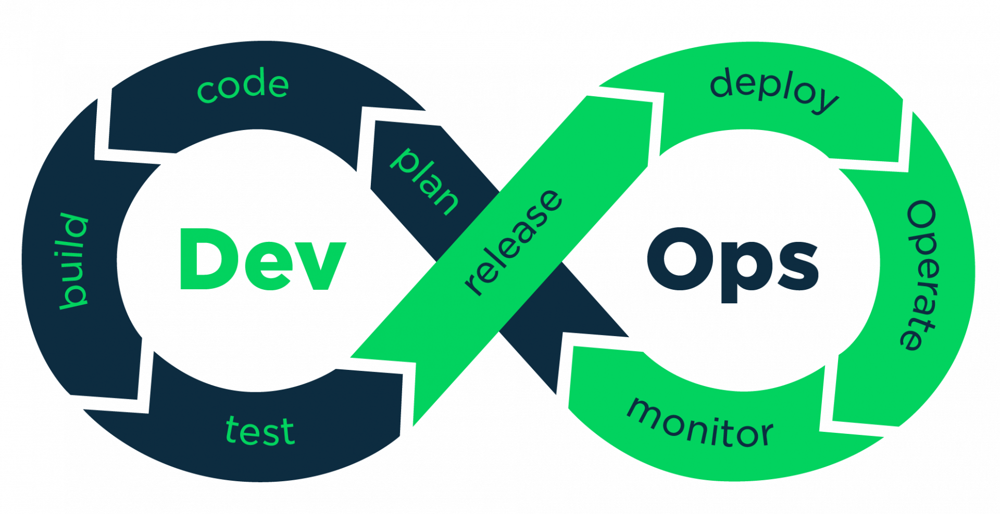

---?color=#0058a9
@title[Introduction]

## @color[#e49436](FORUM PA 2019)
#### Dal catalogo del riuso alla community developers italia: l'esperienza del CNR
##### 2019-05-16

@snap[south byline]
marco.spasiano@color[#e49436](@cnr.it)
@snapend

---?color=#0058a9
@title[Catalogo del Riuso]
## @color[#e49436](Catalogo del Riuso)
 
@ul
- SIGLA	**2005**
- Gestione Accessi **2008**
- SIPER **2008**
- Online interactive helpDesk **2008**
@ulend

---?color=#0058a9
@title[DevOps]
In informatica **DevOps** (dalla contrazione inglese di development, "sviluppo", e operations, qui simile a "messa in produzione" o "deployment") è un metodo di sviluppo del software che punta alla comunicazione, collaborazione e integrazione tra sviluppatori e addetti alle operations della information technology (IT).

---?color=#0058a9
@title[DevOps]

