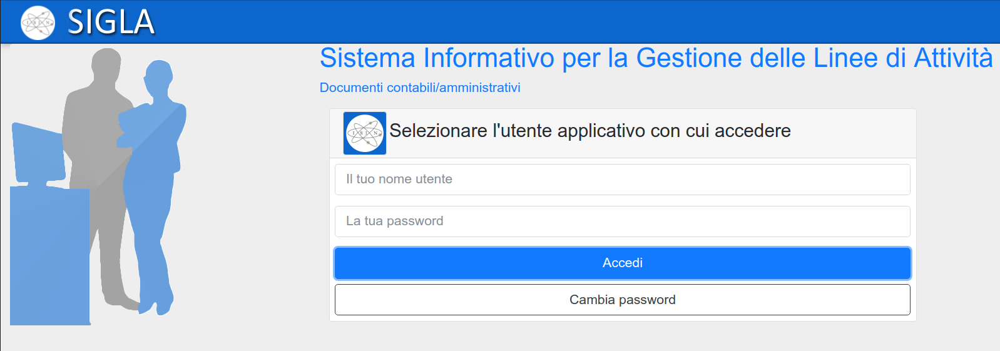
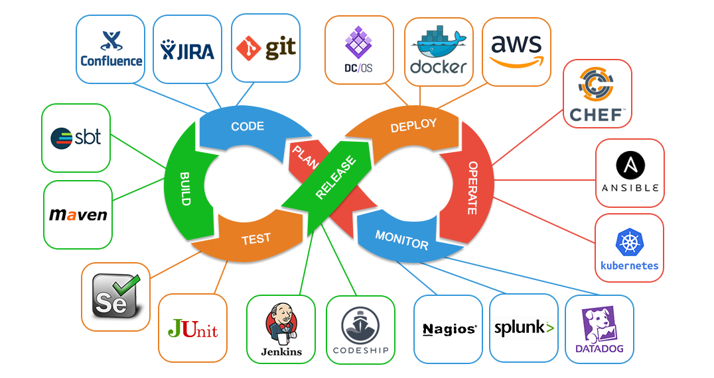

---?color=#0058a9
@title[Introduction]

## @color[#e49436](FORUM PA 2019)
#### Dal catalogo del riuso alla community developers italia: l'esperienza del CNR
##### 2019-05-16

@snap[south byline]
marco.spasiano@color[#e49436](@cnr.it)
@snapend

---?color=#0058a9
@title[Catalogo del Riuso]
## @color[#e49436](Catalogo del Riuso)
 
@ul
- **SIGLA**	@fa[arrow-right] *2005*
- **Gestione Accessi** @fa[arrow-right] *2008*
- **SIPER** @fa[arrow-right] *2008*
- **Online Interactive helpDesk** @fa[arrow-right] *2008*
@ulend

---?color=#0058a9
@title[Community developers italia]
## @color[#e49436](Community developers italia)
 
@ul
- **SIGLA**	@fa[arrow-right] *2019*
- **Online Interactive helpDesk** @fa[arrow-right] *2019*
- **Selezioni on-line** @fa[arrow-right] *2019*
@ulend

---?color=#0058a9
@title[Community developers italia]
@snap[north-west span-50]

@snapend

@snap[north span-50]

@snapend

@snap[north-east span-50]

@snapend

---?color=#0058a9
@title[DevOps]
## @color[#e49436](DevOps)
In informatica **DevOps** (dalla contrazione inglese di development, "sviluppo", e operations, qui simile a "messa in produzione" o "deployment") è un metodo di sviluppo del software che punta alla comunicazione, collaborazione e integrazione tra sviluppatori e addetti alle operations della information technology (IT).

---?color=#0058a9
@title[DevOps]
