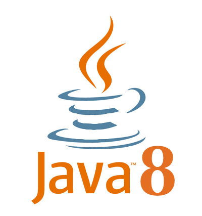

---?color=#0058a9
@title[Introduction]

## @color[#e49436](FORUM PA 2019)
#### Dal catalogo del riuso alla community developers italia: l'esperienza del CNR
##### 2019-05-16

@snap[south byline]
marco.spasiano@color[#e49436](@cnr.it)
@snapend

---?color=#0058a9
@title[Catalogo del Riuso]
## @color[#e49436](Catalogo del Riuso)
 
@ul
- **Sistema Informativo per la Gestione delle Linee di Attività - SIGLA**	@fa[arrow-right] *2005*
- **Gestione Accessi - GAs** @fa[arrow-right] *2008*
- **Servizi In line per il PERsonale - SIPER** @fa[arrow-right] *2008*
- **Online Interactive heLpdesk - OIL** @fa[arrow-right] *2008*
@ulend

---?color=#0058a9
@title[Community developers italia]
## @color[#e49436](Community developers italia)
@css[tip](Entreranno a far parte della community...)
 
@ul
- **Sistema Informativo per la Gestione delle Linee di Attività - SIGLA**
- **Online Interactive heLpdesk - OIL**
- **Selezioni on-line**
@ulend

---?color=#0058a9
@title[Tecnologie]

@snap[north-west span-25]

@snapend
@snap[north span-25 fragment]

@snapend
@snap[north-east span-25 fragment]

@snapend

@snap[west span-25 fragment]

@snapend
@snap[center span-25 fragment]

@snapend
@snap[east span-25 fragment]

@snapend

@snap[south-west span-25 fragment]

@snapend

---?color=#0058a9
@title[Community developers italia - SIGLA]
### @color[#e49436](Sistema Informativo per la Gestione delle Linee di Attività)
@css[tip](Sistema contabile in uso al @color[#e49436](*CNR*), all'@color[#e49436](*ISIN*)  e in fase di estensione per un riuso all'@color[#e49436](*ISS*), tra i vari moduli che compongono il sistema alcuni faranno parte separatamente della community)
@ul[]
- **Integrazione SIOPE+**
- **Integrazione SDI**
- **Integrazione Object Storage @color[#e49436](CMIS,AZURE,S3)**
@ulend

+++?image=assets/img/sigla-architettura-aws.png
@title[SIGLA - architettura aws]

---?color=#0058a9
@title[Community developers italia - Selezioni on-line]
## @color[#e49436](Selezioni on-line)
@css[tip](Sistema di presentazione delle candidature online per il reclutamento del personale dipendente e degli altri rapporti di lavoro e formazione del Consiglio Nazionale delle Ricerche, é in uso al CNR dal 2012 ed è stato richiesto in riuso dall' @color[#e49436](*Accademia dei Lincei*, *Stazione Zoologica Anton Dohrn*, *Istituto Superiore di Sanità*); inoltre con una customizzazione é in uso al @color[#e49436](*Dipartimento della Funzione Pubblica*) per gestire l'elenco degli Organismi Indipendenti di Valutazione.)

+++?image=assets/img/selezioni-online-architettura-aws.png
@title[Selezioni on-line - architettura aws]

---?color=#0058a9
@title[DevOps]
## @color[#e49436](DevOps)
@css[tip](Introducendo una strategia *DevOps* all'interno del CNR è stato possibile implementare nuove funzionalità e applicazioni molto più rapidamente rispetto alle modalità di sviluppo tradizionali, senza contare il fatto che gli stessi sviluppatori, lavorando in prima linea sulla programmazione, sono stati stimolati a scrivere codici di qualità superiore.Un'altra caratteristica fondamentale di un sistema di sviluppo *DevOps* è stata l’integrazione continua *CI* e l'erogazione continua e/o la distribuzione continua *CD*. CI significa che nel processo di sviluppo i test su una porzione di codice sono continui e automatici, mentre CD significa che il processo di messa in produzione del codice validato dopo il dovuto collaudo diventa automatica. È così che abbiamo accellerato i tempi di rilascio.)

---?color=#0058a9
@title[DevOps]
## @color[#e49436](DevOps)
In passato, ad esempio, mettevamo in produzione il nuovo codice ad orari prestabiliti. Ma la velocità delle nuove richieste ha reso questo modello per cicli di rilascio piuttosto obsoleto e in antitesi al *DevOps* che, invece, punta proprio ad automatizzare il ciclo di rilascio per renderlo il più possibile immediato.

+++?color=#0058a9
@title[DevOps]

---?color=#0058a9
@title[Docker & DevOps]
## @color[#e49436](Docker & DevOps)
Il codice del software non è l'unico elemento archiviato nel repository dei Sorgenti, infatti, vengono memorizzati anche gli script che contengono tutti i dettagli delle configurazioni e le definizioni dei Container *Docker*, con questo sistema è stato possibile creare ambienti per la build e il test, nonchè gli ambienti di produzione, e gestire in modo semplice i microservizi.

+++?code=src/docker/sigla.yml&lang=yml&title=Source: SIGLA ISIN Docker Compose File&color=#0058a9
@snap[south span-100 text-08]
@[5-6]
@[7-19]
@[28-40]
@[60-73]
@snapend

---?color=#0058a9
@title[Conclusion]
## @color[#e49436](Domande?)
#### marco.spasiano@color[#e49436](@cnr.it)
@snap[south doclink span-90]
Unisciti alla [community developers italia](https://developers.italia.it/)
@snapend
